# TMS Architecture

This document describes the current system architecture of the Test Management System (TMS) and the proposed architectural changes for each roadmap phase.

---

## Table of Contents

1. [Current Architecture](#current-architecture)
2. [Data Model (ERD)](#data-model-erd)
3. [Frontend Component Tree](#frontend-component-tree)
4. [Phase 1 Changes — Core Enhancements](#phase-1-changes)
5. [Phase 2 Changes — New Feature Set](#phase-2-changes)
6. [Phase 3 Changes — Collaboration & Integrations](#phase-3-changes)
7. [Phase 4 Changes — Admin Role & Platform](#phase-4-changes)

---

## Current Architecture

The TMS is a full-stack monolith with three layers: a React single-page application, a Node.js/Express REST API, and an SQLite database.

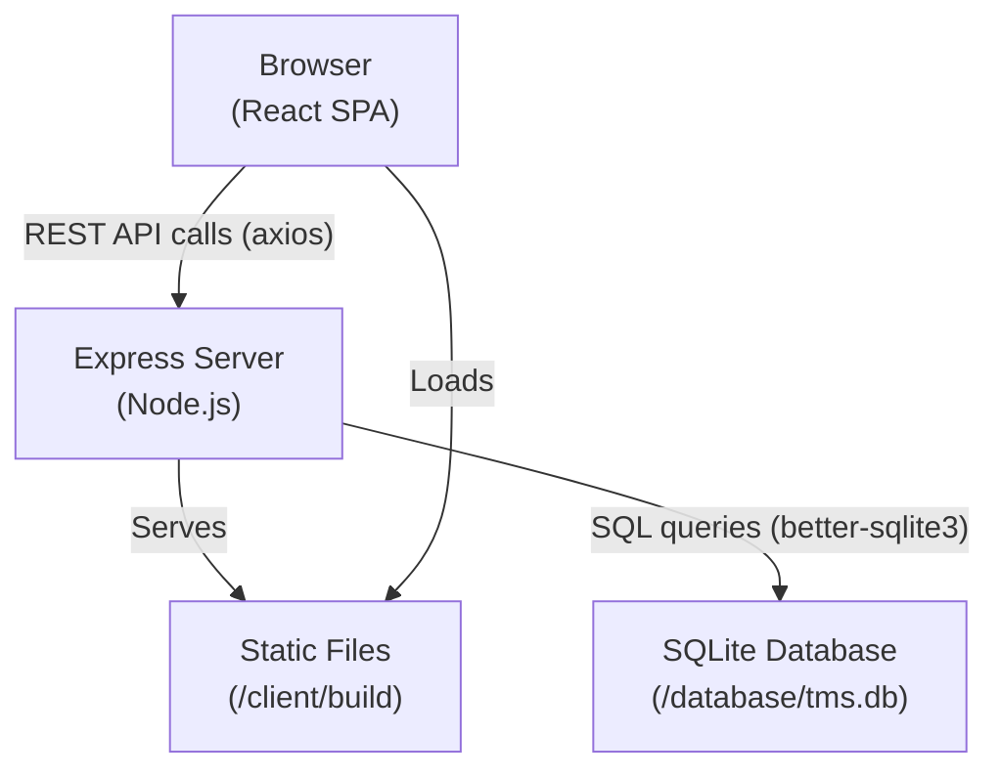

### Directory Layout

```
project-root/
├── client/                     # React SPA (Vite or CRA)
│   └── src/
│       ├── components/         # Shared UI: Header, Breadcrumb, Grid, etc.
│       ├── pages/              # Route-level page components
│       ├── context/            # AuthContext, ThemeContext
│       └── services/api.js     # Axios wrapper for all API calls
├── server/                     # Express backend
│   ├── database/
│   │   ├── schema.sql          # DDL for all tables
│   │   └── db.js               # SQLite connection + schema init
│   ├── routes/                 # One file per entity group
│   ├── middleware/auth.js       # Session authentication middleware
│   └── server.js               # Entry point, middleware wiring
└── docs/                       # This documentation folder
```

### Request / Response Flow

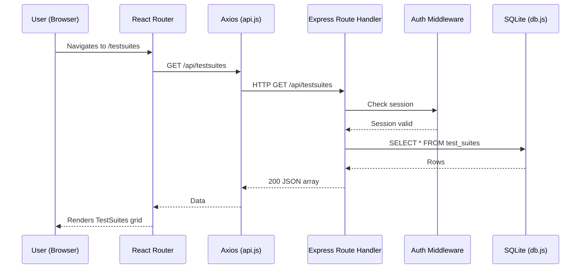

---

## Data Model (ERD)

The current database schema with all foreign key relationships.

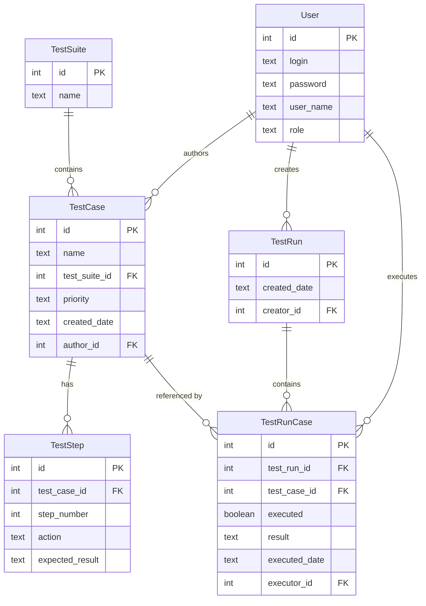

---

## Frontend Component Tree

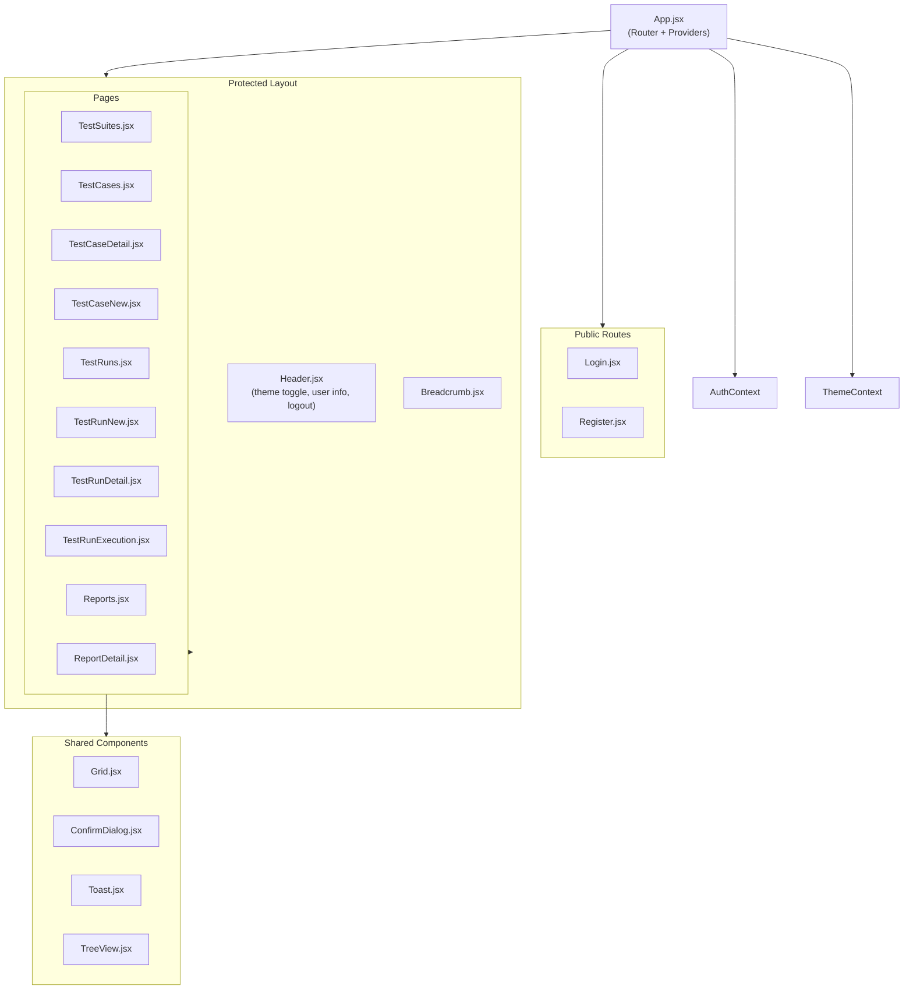

---

## Phase 1 Changes

**Core Enhancements** — no new tables, minimal backend changes.

### Changes Summary

| Layer | Change |
|-------|--------|
| Frontend | `Grid.jsx` gains sort state, column filter inputs, and checkbox selection column |
| Frontend | New `SearchBar.jsx` component in `Header.jsx` |
| Frontend | New `BulkActionToolbar.jsx` component |
| Frontend | New `CloneModal.jsx` for TestCase cloning |
| Backend | Optional `?sort=`, `?order=`, `?filter=` query parameters on list endpoints |
| Database | No schema changes |

### Search Query Flow

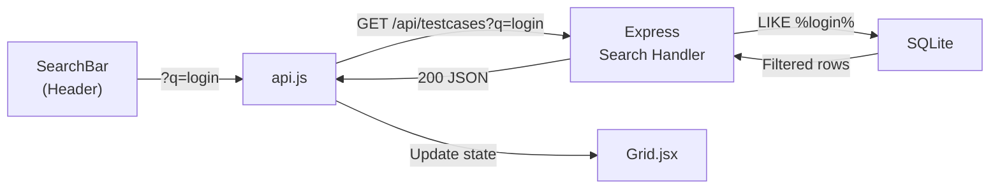

---

## Phase 2 Changes

**New Feature Set** — new database tables and new frontend pages/components.

### New Database Tables

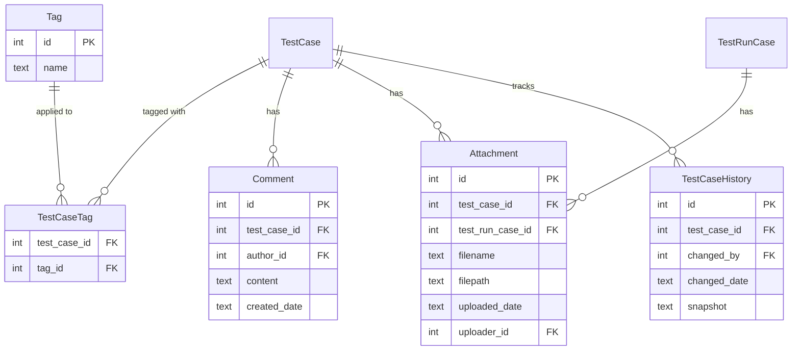

### New Frontend Components / Pages

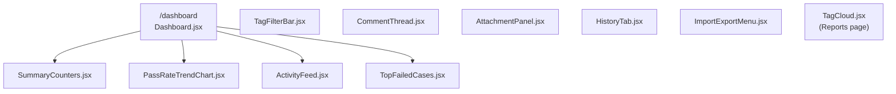

### File Upload Flow

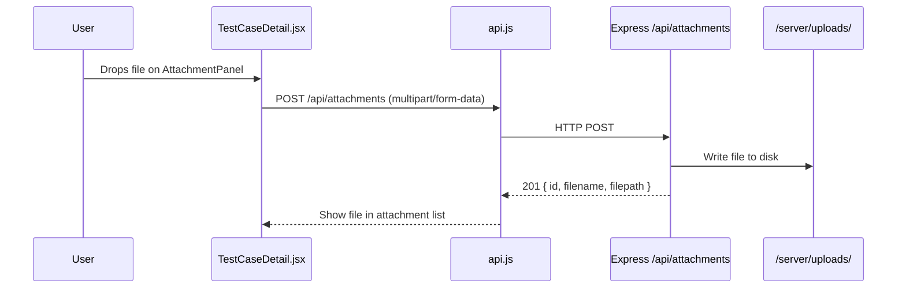

---

## Phase 3 Changes

**Collaboration & Integrations** — WebSocket server, webhook engine, external links.

### Architecture with WebSockets

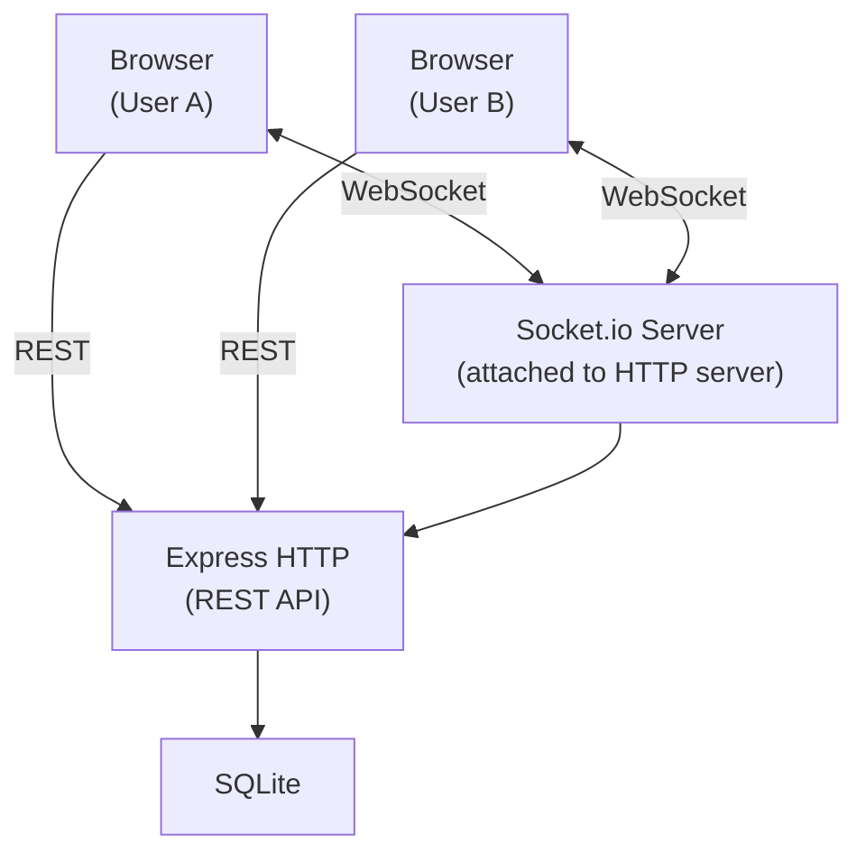

### WebSocket Event Model

| Event (server → client) | Payload | Trigger |
|--------------------------|---------|---------|
| `testruncase:updated` | `{ testRunCaseId, result, executed }` | Any user saves execution result |
| `testcase:updated` | `{ testCaseId, name, priority }` | Any user saves TestCase edits |
| `testrun:completed` | `{ testRunId }` | All cases in a run are executed |

### New Database Tables (Phase 3)

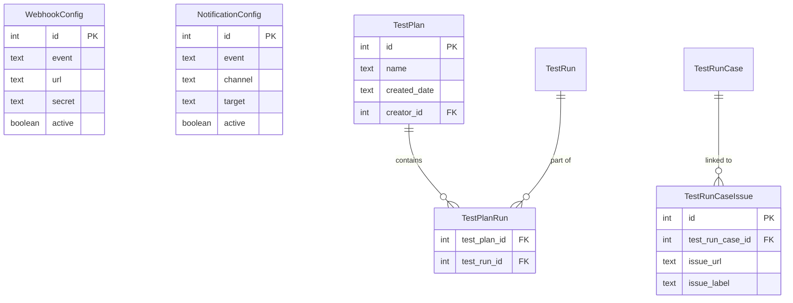

---

## Phase 4 Changes

**Admin Role & Platform** — complete Admin section, audit logging, system config.

### New Database Tables (Phase 4)

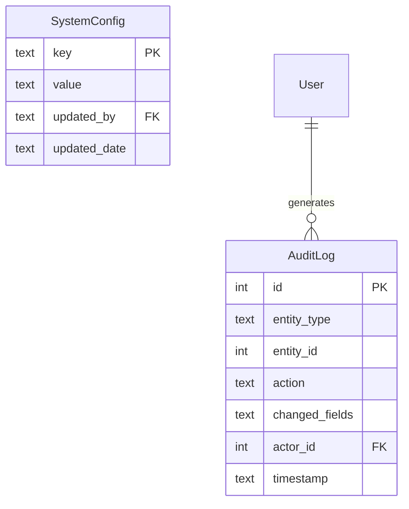

### Admin Section Routes

```
/admin                  → Admin dashboard (Phase 4)
/admin/users            → User Management (4.1)
/admin/audit            → Audit Log (4.2)
/admin/config           → System Configuration (4.3)
/admin/archive          → Data Retention / Archive (4.4)
/admin/webhooks         → Webhook Config (Phase 3, managed here)
/admin/notifications    → Notification Config (Phase 3, managed here)
```

---

## Technology Decisions Log

| Decision | Chosen Approach | Reason |
|----------|----------------|--------|
| Database | SQLite (current) | Zero-config, sufficient for 1–10 users |
| Auth | Express session + cookie | Simple, no JWT refresh complexity needed for demo scale |
| Real-time (Phase 3) | Socket.io | Drop-in with Express, automatic fallback to polling |
| File storage (Phase 2) | Local filesystem `/server/uploads/` | Simple; swap to S3-compatible storage later without API change |
| Charts | recharts (current) | React-native, small bundle, sufficient for donut + line charts |
| Import/Export (Phase 2) | CSV (papaparse) + JSON | Universal formats; Excel (.xlsx) can be added later via sheetjs |
